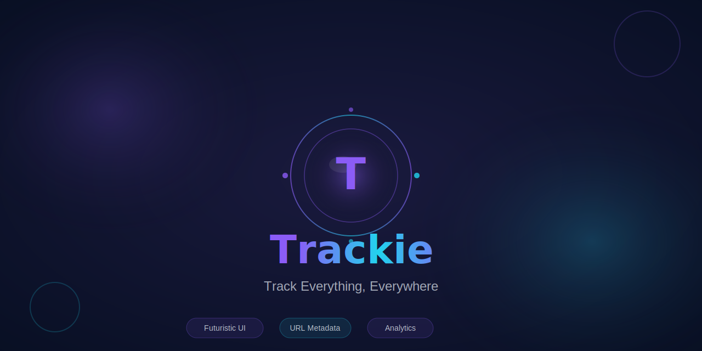
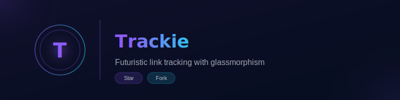

<!DOCTYPE html>
<html lang="en">
<head>
  <meta charset="UTF-8">
  <meta name="viewport" content="width=device-width, initial-scale=1.0">
  <title>Trackie Branding Assets</title>
  
</head>
<body>
  

    <header>
      <h1>Trackie Branding Assets</h1>
      
Liquid Nebula Design System • Glassmorphism Effects

    </header>
    
    <!-- Logo Section -->
    <section>
      <h2>Logos</h2>
      

        

          <h3>Main Logo</h3>
          
Primary logo with glass sphere effect

          

            
          

          <a href="assets/branding/logo.svg" download class="download-btn">Download SVG</a>
        

        
        

          <h3>Small Logo</h3>
          
For badges and compact spaces

          

            
          

          <a href="assets/branding/logo-sm.svg" download class="download-btn">Download SVG</a>
        

      

    </section>
    
    <!-- GitHub Assets -->
    <section>
      <h2>GitHub Assets</h2>
      

        

          <h3>Social Preview Thumbnail</h3>
          
1280x640px - Repository social preview

          

            
          

          <a href="assets/branding/github-thumbnail.svg" download class="download-btn">Download SVG</a>
        

        
        

          <h3>Banner</h3>
          
800x200px - For README headers

          

            
          

          <a href="assets/branding/github-banner.svg" download class="download-btn">Download SVG</a>
        

      

    </section>
    
    <!-- Color Palette -->
    <section>
      <h2>Color Palette</h2>
      

        

          

          
Violet Liquid

          
#8B5CF6

        

        

          

          
Electric Cyan

          
#22D3EE

        

        

          

          
Deep Space

          
#060E20

        

        

          

          
Gradient

          
#8B5CF6 → #22D3EE

        

      

    </section>
    
    <!-- Usage Guide -->
    <section>
      <h2>Usage Guide</h2>
      

        <h3>README.md Usage</h3>
        <pre>&lt;div align="center"&gt;
  &lt;img src="assets/branding/logo.svg" alt="Trackie Logo" width="120"&gt;
  &lt;h1&gt;Trackie&lt;/h1&gt;
  &lt;p&gt;Track Everything, Everywhere&lt;/p&gt;
&lt;/div&gt;</pre>
        
        <h3 style="margin-top: 32px;">Social Preview Setup</h3>
        <ul>
          <li>Go to your GitHub repository Settings</li>
          <li>Scroll to "Social Preview"</li>
          <li>Upload the github-thumbnail.svg or a PNG conversion</li>
        </ul>
        
        <h3 style="margin-top: 32px;">Design Guidelines</h3>
        <ul>
          <li>Always use on dark backgrounds (#060E20) for best glassmorphism effect</li>
          <li>Maintain minimum 20% breathing space around the logo</li>
          <li>Use the gradient palette consistently across all materials</li>
        </ul>
      

    </section>
    
    <footer>
      
Trackie • Liquid Nebula Design • Powered by Flutter

    </footer>
  

</body>
</html>
