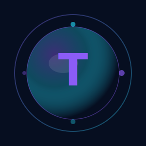

<div align="center">
  
  <h1>Trackie</h1>
  <p>Track Everything, Everywhere</p>
  
  <p>
    
    
    
    
  </p>
</div>

---

## About

**Trackie** (renamed to **Aura Learning**) is an open-source application for managing your personal learning. Organize courses, books, PDFs, podcasts, videos, and more in one place with a beautiful **Liquid Nebula** glassmorphism interface.

### Version: `v1.0.0 - Liquid Nebula`

---

## Features

| Category | Features |
|----------|----------|
| **Management** | Full CRUD operations, multiple content types |
| **Organization** | Categories, tags, favorites, pinned items |
| **Search** | Advanced filters, real-time search |
| **Actions** | Bulk actions, duplicate, import/export |
| **UI/UX** | Liquid Glass UI, dark/light themes |
| **Statistics** | Dashboard with progress charts |
| **Metadata** | Auto-fetch URLs (title, thumbnail, favicon) |
| **Internationalization** | English & Spanish language support |
| **Timer** | Pomodoro timer for focused learning |
| **Notes** | Personal notes with pin support |
| **Reminders** | Date/time reminders with notifications |

---

## Tech Stack

- **Framework**: Flutter 3.41+
- **Language**: Dart 3.11+
- **State Management**: Riverpod
- **Storage**: Hive (100% local, works on web)
- **UI**: Custom Glassmorphism + shadcn/ui inspired design

---

## Installation

```bash
# Clone repository
git clone https://github.com/0gloomdev/trackie.git
cd trackie

# Install dependencies
flutter pub get

# Run in development
flutter run

# Build for Web
flutter build web --release

# Build for Android
flutter build apk --release

# Build for Linux
flutter build linux --release
```

---

## Project Structure

```
lib/
├── core/
│   ├── constants/     # App constants, content types
│   ├── services/      # URL metadata service
│   ├── theme/         # App theme (light/dark)
│   ├── utils/         # Translations
│   └── widgets/       # shadcn-style widgets
├── data/
│   ├── models/        # LearningItem, Category, Tag, Settings
│   └── repositories/  # Hive repositories
├── domain/
│   └── providers/     # Riverpod state management
└── presentation/
    └── screens/       # UI screens (home, library, detail, etc.)
```

---

## Screens

| Screen | Description |
|--------|-------------|
| **Dashboard** | Overview with stats, weekly chart, recent items |
| **Library** | Grid/list view of all saved items |
| **Courses** | Filtered view of course content |
| **Achievements** | XP system and unlockable achievements |
| **Community** | User activity and progress tracking |
| **Notes** | Personal notes with search |
| **Reminders** | Date/time based notifications |
| **Timer** | Pomodoro timer with session tracking |
| **Settings** | Profile, appearance, language, data management |

---

## Contributing

All contributions are welcome! See [CONTRIBUTING.md](CONTRIBUTING.md) for details.

1. Fork the repository
2. Create your branch (`git checkout -b feature/amazing-feature`)
3. Commit your changes (`git commit -m 'feat: add amazing feature'`)
4. Push to the branch (`git push origin feature/amazing-feature`)
5. Open a Pull Request

---

## Changelog

### v1.0.0 - Liquid Nebula (Current)
- Complete shadcn/ui-inspired design migration
- Full internationalization (English/Spanish)
- All 16 screens migrated to new UI
- Keyboard shortcuts implementation
- Pomodoro timer with session tracking
- Notes and reminders system

### v0.5.0 - Liquid Glass
- Dashboard with visual statistics
- Pinned items system
- Advanced real-time search
- Filters by type, status, priority
- Bulk actions (multi-select)
- Duplicate items
- Auto-fetch URL metadata

### v0.4.0 - Crystal Clear
- Complete Glassmorphism UI
- Dark/light theme

### v0.3.0 - Solid Foundation
- Complete data model
- Hive repositories

---

## Roadmap

- [ ] Collections (item grouping)
- [ ] JSON Import/Export
- [ ] Integrated content reader
- [ ] Advanced markdown notes
- [ ] Installable PWA
- [ ] Unit tests

---

## License

MIT License - see [LICENSE](LICENSE) for details.

---

## Branding Assets

For branding materials (logos, banners, color palette), see [BRANDING.md](BRANDING.md).

---

<div align="center">
  ⭐ Made with ❤️ by the community
</div>
